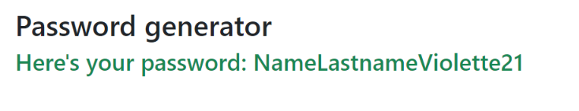

## ASSIGNMENT 

Ask the user for their name,
then ask for their last name,
then ask for their favorite color.
Finally, write on the page: firstnamelastnamefavoritecolor21.

## SOLUTION 

### Data Collection
1. Ask the user for their first name
2. Ask the user for their last name
3. Ask the user for their favorite color

### Program Logic
1. Concatenate the strings of the first name, last name, favorite color, and add "21" to them.
2. Prepare the result message to be printed (the password)

### Ouput
Print the message to the page: find the HTML element with the specified id on the page and insert the text of the result inside.

